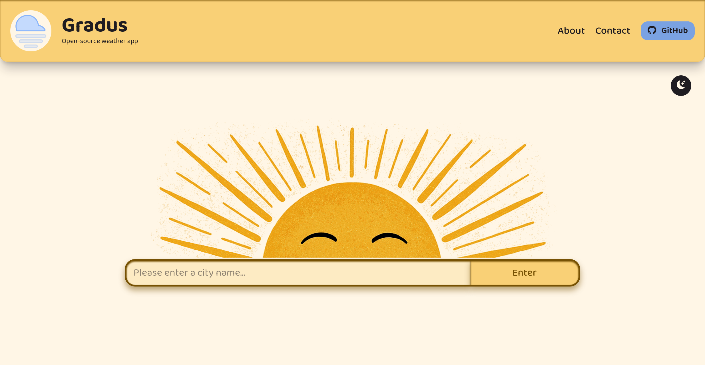

# Gradus

A simple weather app that lets you search for any city and instantly see its current conditions including temperature, feels like, precipitation, and wind speed. Gradus pairs [Open-Meteo](https://open-meteo.com/)'s geocoding and forecast APIs to turn a place name into live weather data. The name is derived from the Latin word for temperature.

Built for the [HackYourFuture](https://www.hackyourfuture.net/) program as part of the front-end specialization track.

<p align="center">
  
</p>

## Features

- 🔎 **City search:** type a city name and get its current weather
- 🌡️ **Current conditions:** temperature, feels-like, precipitation, and wind speed
- 🎨 **Weather icons:** condition codes mapped to icons and labels
- 🌗 **Light & dark themes:** toggle with persisted theme on the document
- 📱 **Responsive:** mobile-first layout that adapts to larger screens
- ✉️ **Contact form:** with live, accessible client-side validation
- 🧭 **Custom 404 page:** friendly not-found page that links home

## Tech stack

- [React 19](https://react.dev/) + [TypeScript](https://www.typescriptlang.org/)
- [Vite](https://vite.dev/) - dev server and build tooling
- [Tailwind CSS v4](https://tailwindcss.com/) - utility-first styling
- [React Router](https://reactrouter.com/) - client-side routing
- [Bootstrap Icons](https://icons.getbootstrap.com/) - iconography
- [Open-Meteo](https://open-meteo.com/) - geocoding & forecast APIs (no key required)
- ESLint + Prettier — linting and formatting

## Getting started

**Prerequisites:** [Node.js](https://nodejs.org/) (18+) and npm.

```bash
# install dependencies
npm install

# start the dev server (http://localhost:5173)
npm run dev
```

### Available scripts

| Command           | Description                          |
| ----------------- | ------------------------------------ |
| `npm run dev`     | Start the Vite dev server            |
| `npm run build`   | Type-check and build for production  |
| `npm run preview` | Preview the production build locally |
| `npm run lint`    | Run ESLint across the project        |

## How it works

1. On the home page, the search bar geocodes the entered city via Open-Meteo's geocoding API to find its coordinates.
2. The app navigates to `/weather/:name/:latitude/:longitude`, carrying the result in the URL (so weather links are shareable and refresh-safe).
3. The weather page reads those URL params, fetches the current forecast for the coordinates, and renders it in a weather card.

## Project structure

```
src/
├─ components/   # reusable UI (SearchBar, WeatherCard, FormField, Header, Footer, …)
├─ pages/        # routed views (Home, Weather, About, Contact, NotFound)
├─ utils/        # helpers (weather-code → icon/label mapping)
├─ assets/       # images and icons
├─ App.tsx       # routes and app shell
└─ main.tsx      # entry point
```

## Attributions

- Weather Data: [Open-Meteo](https://open-meteo.com/)
- Fonts: [Fontsource](https://fontsource.org/)
- Icons: [Bootstrap Icons](https://icons.getbootstrap.com/)
- Illustrations: [SVG Repo](https://www.svgrepo.com/)
